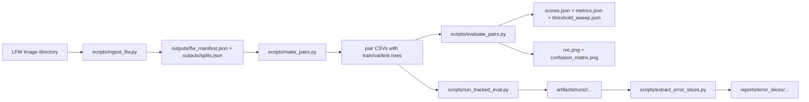

# LFW Verification Milestone 2 (v0.2)

This project now includes the Milestone 1 data pipeline and the Milestone 2 evaluation stack for face verification.

Milestone 1 covers:
- deterministic LFW ingestion from a local dataset directory
- deterministic identity-level train/val/test splitting
- deterministic positive/negative pair generation saved to disk
- vectorized cosine similarity and Euclidean distance benchmarking

Milestone 2 adds:
- typed evaluation configs
- pair/config validation
- deterministic grayscale image loading and baseline feature extraction
- threshold sweeps with balanced-accuracy selection
- ROC and confusion-matrix plots
- tracked experiment runs
- error-slice extraction
- baseline and improved experiment configs

## Repository Layout

- `src/lfw_verif/`: package code for ingestion, pairs, similarity, evaluation, plotting, tracking, and slicing
- `scripts/`: CLI entrypoints for ingestion, pair generation, evaluation, tracked runs, and error slicing
- `configs/`: baseline and improved Milestone 2 configs plus earlier milestone configs
- `tests/`: unit, integration, and determinism tests
- `outputs/`: generated Milestone 1 manifests, splits, pairs, and benchmark artifacts
- `artifacts/runs/`: tracked Milestone 2 runs
- `reports/`: report figures, slice examples, and run-comparison tables

## Pipeline Diagram



## Environment Setup

### Windows PowerShell

```powershell
py -m venv .venv
.\.venv\Scripts\Activate.ps1
python -m pip install --upgrade pip
pip install -r requirements.txt
pip install -e .
```

### macOS/Linux

```bash
python3 -m venv .venv
source .venv/bin/activate
python -m pip install --upgrade pip
pip install -r requirements.txt
pip install -e .
```

## Milestone 1 Data Preparation

Set `--lfw_root` to your local LFW directory.

```powershell
$LFW_ROOT="C:\path\to\lfw_or_lfw_funneled"
python scripts/ingest_lfw.py --lfw_root "$LFW_ROOT" --out_dir outputs --config configs/m1.yaml
python scripts/make_pairs.py --manifest outputs/lfw_manifest.json --splits outputs/splits.json --out_dir outputs --config configs/m1.yaml
python scripts/bench_similarity.py --out_dir outputs --config configs/m1.yaml
```

## Reproduce The Baseline Experiment

The real LFW baseline evaluation pairs are already staged at:
- `artifacts/real_eval/baseline_eval_pairs.csv`

Run the tracked baseline evaluation with:

```powershell
$env:PYTHONPATH="src"
python scripts/run_tracked_eval.py --pairs artifacts/real_eval/baseline_eval_pairs.csv --config configs/m2_baseline.yaml --image-size 32 32
```

This writes a new run under `artifacts/runs/` with:
- `scores.json`
- `metrics.json`
- `threshold_sweep.json`
- `roc.png`
- `confusion_matrix.png`
- `run.json`

## Reproduce The Improved Experiment

The improved LFW evaluation pairs were regenerated with the `prefer_unique` pair policy and staged at:
- `artifacts/real_eval/improved_eval_pairs.csv`

```powershell
$env:PYTHONPATH="src"
python scripts/run_tracked_eval.py --pairs artifacts/real_eval/improved_eval_pairs.csv --config configs/m2_improved.yaml --image-size 32 32
```

The improved config keeps the evaluation pipeline unchanged and changes the pair-generation policy to prefer unique positive pairs.

## Generate Error Slices

Use any tracked run directory produced by `run_tracked_eval.py`:

```powershell
python scripts/extract_error_slices.py --run-dir artifacts/runs/<run_id> --output-dir reports/error_slices/<label> --max-examples 2
```

## Report Artifacts

Milestone 2 report outputs live in `reports/`:
- `milestone2_report_real.pdf`
- `milestone2_report_real.md`
- `real_run_comparison.csv`
- `real_run_comparison.md`
- `real_error_slices/`
- `report_manifest.json`

Tracked experiment outputs live in `artifacts/runs/`.
Submission report path: `reports/milestone2_report_real.pdf`
Key reporting runs:
- baseline: `artifacts/runs/m2_baseline_20260326T182323665994Z`
- improved: `artifacts/runs/m2_improved_20260326T182619316513Z`

## Verification

Run the test suite with:

```powershell
python -m pytest -q
```
