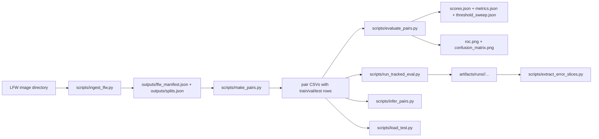

# LFW Verification Project

This repository contains our MSML/MSAI 605 face-verification project built around the Labeled Faces in the Wild (LFW) dataset. The codebase keeps the deterministic data-preparation backbone from Milestone 1, the evaluation and experiment-tracking workflow from Milestone 2, and the current embedding-based inference components added for Milestone 3 work.

The repository currently includes:
- deterministic LFW ingestion from a local dataset directory
- deterministic identity-level train/val/test splitting
- deterministic positive/negative pair generation saved to disk
- vectorized scoring and benchmarking utilities from the earlier baseline pipeline
- typed evaluation configs, validation checks, threshold sweeps, tracked runs, and error-slice extraction
- embedding, pair-inference, confidence, Docker, and load-test utilities that are being used for Milestone 3 development

## Repository Layout

- `src/lfw_verif/`: package code for ingestion, pair generation, evaluation, plotting, tracking, embeddings, confidence, and inference
- `scripts/`: runnable entrypoints for ingestion, pair generation, evaluation, tracked runs, error slicing, pair inference, and load testing
- `configs/`: milestone configs for ingestion, evaluation, benchmarking, and current inference settings
- `tests/`: unit, integration, determinism, and smoke tests
- `outputs/`: generated Milestone 1 artifacts such as manifests, splits, pairs, and benchmarks
- `artifacts/real_eval/`: committed pair CSVs used for evaluation work
- `artifacts/runs/`: tracked evaluation runs generated locally
- `reports/`: report figures, comparison tables, and exported report assets

## Pipeline Summary

The main project flow is still organized around a deterministic backbone:



The current inference code path is structured as:
1. deterministic image preprocessing
2. embedding generation
3. cosine similarity scoring
4. threshold-based decision
5. confidence computation
6. latency measurement

## Environment Setup

### Windows PowerShell

```powershell
py -m venv .venv
.\.venv\Scripts\Activate.ps1
python -m pip install --upgrade pip
pip install -r requirements.txt
pip install -e .
```

### macOS/Linux

```bash
python3 -m venv .venv
source .venv/bin/activate
python -m pip install --upgrade pip
pip install -r requirements.txt
pip install -e .
```

The current dependency set includes the embedding runtime used by the inference modules (`torch`, `torchvision`, and `facenet-pytorch`) in addition to the Milestone 1 and 2 project requirements.

## Milestone 1 Data Preparation

Set `--lfw_root` to your local LFW directory.

```powershell
$LFW_ROOT="C:\path\to\lfw_or_lfw_funneled"
python scripts/ingest_lfw.py --lfw_root "$LFW_ROOT" --out_dir outputs --config configs/m1.yaml
python scripts/make_pairs.py --manifest outputs/lfw_manifest.json --splits outputs/splits.json --out_dir outputs --config configs/m1.yaml
python scripts/bench_similarity.py --out_dir outputs --config configs/m1.yaml
```

## Milestone 2 Evaluation Workflow

The real LFW evaluation pair files staged in the repository are:
- `artifacts/real_eval/baseline_eval_pairs.csv`
- `artifacts/real_eval/improved_eval_pairs.csv`

Run the tracked baseline evaluation with:

```powershell
$env:PYTHONPATH="src"
python scripts/run_tracked_eval.py --pairs artifacts/real_eval/baseline_eval_pairs.csv --config configs/m2_baseline.yaml --image-size 32 32
```

Run the tracked improved evaluation with:

```powershell
$env:PYTHONPATH="src"
python scripts/run_tracked_eval.py --pairs artifacts/real_eval/improved_eval_pairs.csv --config configs/m2_improved.yaml --image-size 32 32
```

Each tracked run writes a directory under `artifacts/runs/` containing:
- `scores.json`
- `metrics.json`
- `threshold_sweep.json`
- `roc.png`
- `confusion_matrix.png`
- `run.json`

Generate error slices from any tracked run directory with:

```powershell
python scripts/extract_error_slices.py --run-dir artifacts/runs/<run_id> --output-dir reports/error_slices/<label> --max-examples 2
```

## Current Inference Utilities

The repository now also includes current Milestone 3 development utilities:
- `src/lfw_verif/embeddings.py`
- `src/lfw_verif/confidence.py`
- `src/lfw_verif/inference.py`
- `scripts/infer_pairs.py`
- `scripts/load_test.py`
- `configs/m3_inference.yaml`
- `Dockerfile`

These files are the current inference-facing entrypoints in the repo and are intended to be used with the embedding-based verification path.

Example CLI help:

```powershell
python scripts/infer_pairs.py --help
python scripts/load_test.py --help
```

## Docker

A Docker build path is defined in `Dockerfile`.

Build the image with:

```powershell
docker build -t lfw-verification .
```

The container currently installs the project dependencies and the embedding runtime used by the inference modules.

## Reports And Artifacts

Milestone 2 report outputs live in `reports/`, including:
- `Milestone2_report.pdf`
- `real_run_comparison.csv`
- `real_run_comparison.md`
- `report_manifest.json`
- ROC and confusion-matrix figures

Tracked evaluation outputs are written under `artifacts/runs/`.

## Verification

Run the full test suite with:

```powershell
python -m pytest -q
```

If you only want the newer inference-related tests:

```powershell
python -m pytest tests/test_inference.py tests/test_smoke.py -q
```
