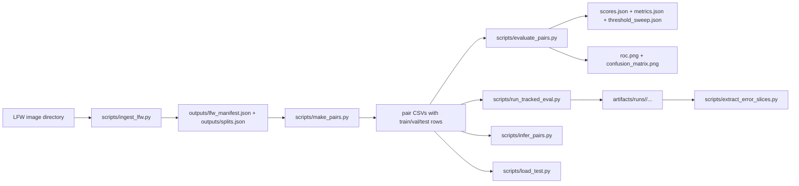

# LFW Verification Project

This repository contains our MSML/MSAI 605 face-verification project built around the Labeled Faces in the Wild (LFW) dataset. The codebase keeps the deterministic data-preparation backbone from Milestone 1, the evaluation and experiment-tracking workflow from Milestone 2, and the current embedding-based inference components added for Milestone 3 work.

The repository currently includes:
- deterministic LFW ingestion from a local dataset directory
- deterministic identity-level train/val/test splitting
- deterministic positive/negative pair generation saved to disk
- vectorized scoring and benchmarking utilities from the earlier baseline pipeline
- typed evaluation configs, validation checks, threshold sweeps, tracked runs, and error-slice extraction
- embedding, pair-inference, confidence, Docker, and load-test utilities that are being used for Milestone 3 development

## Repository Layout

- `src/lfw_verif/`: package code for ingestion, pair generation, evaluation, plotting, tracking, embeddings, confidence, and inference
- `scripts/`: runnable entrypoints for ingestion, pair generation, evaluation, tracked runs, error slicing, pair inference, and load testing
- `configs/`: milestone configs for ingestion, evaluation, benchmarking, and current inference settings
- `tests/`: unit, integration, determinism, and smoke tests
- `outputs/`: generated Milestone 1 artifacts such as manifests, splits, pairs, and benchmarks
- `artifacts/real_eval/`: committed pair CSVs used for evaluation work
- `artifacts/runs/`: tracked evaluation runs generated locally
- `reports/`: report figures, comparison tables, and exported report assets

## Pipeline Summary

The main project flow is still organized around a deterministic backbone:



The current inference code path is structured as:
1. deterministic image preprocessing
2. embedding generation
3. cosine similarity scoring
4. threshold-based decision
5. confidence computation
6. latency measurement

## Environment Setup

### Windows PowerShell

```powershell
py -m venv .venv
.\.venv\Scripts\Activate.ps1
python -m pip install --upgrade pip
pip install -r requirements.txt
pip install -e .
```

### macOS/Linux

```bash
python3 -m venv .venv
source .venv/bin/activate
python -m pip install --upgrade pip
pip install -r requirements.txt
pip install -e .
```

The current dependency set includes the embedding runtime used by the inference modules (`torch`, `torchvision`, and `facenet-pytorch`) in addition to the Milestone 1 and 2 project requirements.

## Milestone 1 Data Preparation

Set `--lfw_root` to your local LFW directory.

```powershell
$LFW_ROOT="C:\path\to\lfw_or_lfw_funneled"
python scripts/ingest_lfw.py --lfw_root "$LFW_ROOT" --out_dir outputs --config configs/m1.yaml
python scripts/make_pairs.py --manifest outputs/lfw_manifest.json --splits outputs/splits.json --out_dir outputs --config configs/m1.yaml
python scripts/bench_similarity.py --out_dir outputs --config configs/m1.yaml
```

## Milestone 2 Evaluation Workflow

The real LFW evaluation pair files staged in the repository are:
- `artifacts/real_eval/baseline_eval_pairs.csv`
- `artifacts/real_eval/improved_eval_pairs.csv`

Run the tracked baseline evaluation with:

```powershell
$env:PYTHONPATH="src"
python scripts/run_tracked_eval.py --pairs artifacts/real_eval/baseline_eval_pairs.csv --config configs/m2_baseline.yaml --image-size 32 32
```

Run the tracked improved evaluation with:

```powershell
$env:PYTHONPATH="src"
python scripts/run_tracked_eval.py --pairs artifacts/real_eval/improved_eval_pairs.csv --config configs/m2_improved.yaml --image-size 32 32
```

Each tracked run writes a directory under `artifacts/runs/` containing:
- `scores.json`
- `metrics.json`
- `threshold_sweep.json`
- `roc.png`
- `confusion_matrix.png`
- `run.json`

Generate error slices from any tracked run directory with:

```powershell
python scripts/extract_error_slices.py --run-dir artifacts/runs/<run_id> --output-dir reports/error_slices/<label> --max-examples 2
```
## Milestone 3: Embedding-Based Inference System

Milestone 3 upgrades the face verification system from a weak placeholder representation to an
embedding-based pipeline, packages it in Docker, and measures runtime behavior under concurrent usage.

### What Milestone 3 adds
- FaceNet (InceptionResnetV1, pretrained on VGGFace2) embedding stage (512-dim vectors)
- Cosine similarity scoring from embeddings
- Calibrated confidence output (linear threshold scaling, range [0.0, 1.0])
- CLI inference interface (single pair and batch modes)
- Docker packaging for reproducible deployment
- Concurrency load test with throughput and p95 latency reporting

### Pipeline Summary
- Image A + Image B
- Preprocess (resize 160x160, normalize [-1,1])
- Embed (FaceNet InceptionResnetV1, 512-dim)
- Cosine Similarity Score
- Threshold Decision (threshold in configs/m3_inference.yaml)
- Calibrated Confidence
- Output: score, decision, confidence, latency

### Confidence Explanation
Confidence is computed via linear scaling around the operating threshold:
- At threshold → 0.5 (maximum uncertainty)
- Score = 1.0 → 1.0 (maximum SAME confidence)
- Score = -1.0 → 0.0 (maximum DIFFERENT confidence)
- Above 0.5 = SAME, below 0.5 = DIFFERENT

### Design Notes
- **Embedding model:** FaceNet InceptionResnetV1 pretrained on VGGFace2 (512-dim)
- **Threshold:** 0.6 (selected on val split using balanced-accuracy rule)
- **Confidence:** Linear threshold scaling — score at threshold = 0.5, scales to 0.0 and 1.0 at extremes

### Environment Setup
```bash
python -m venv .venv
# Windows
.\.venv\Scripts\Activate.ps1
# Mac/Linux
source .venv/bin/activate

pip install --upgrade pip
pip install -r requirements.txt
pip install facenet-pytorch --no-deps
pip install -e . --no-deps
pip install requests tqdm
```

### Docker Setup
```bash
# Build
docker build -t faceoff-m3 .

# Single pair inference
docker run --rm faceoff-m3 python scripts/infer_pairs.py \
  --image-a path/to/face_a.jpg \
  --image-b path/to/face_b.jpg

# Batch inference
docker run --rm faceoff-m3 python scripts/infer_pairs.py \
  --pairs-csv artifacts/real_eval/m3_sample_pairs.csv \
  --output-json reports/infer_results.json
```

### CLI Inference (local)
```bash
# Single pair
python scripts/infer_pairs.py --image-a path/to/a.jpg --image-b path/to/b.jpg

# Batch
python scripts/infer_pairs.py \
  --pairs-csv artifacts/real_eval/m3_sample_pairs.csv \
  --output-json reports/infer_results.json
```

### Load Test
```bash
python scripts/load_test.py \
  --pairs-csv artifacts/real_eval/m3_sample_pairs.csv \
  --num-workers 4 \
  --num-requests 20 \
  --output-json reports/load_test_results.json
```

### Run Tests
```bash
python -m pytest -q
```

### Milestone 3 Artifact Paths
- Inference config: `configs/m3_inference.yaml`
- CLI script: `scripts/infer_pairs.py`
- Load test script: `scripts/load_test.py`
- Sample pairs: `artifacts/real_eval/m3_sample_pairs.csv`
- Load test results: `reports/load_test_results.json`
- Sample inference results: `reports/infer_results.json`

### Milestone 3 Tag
`v0.3`

## Current Inference Utilities

The repository now also includes current Milestone 3 development utilities:
- `src/lfw_verif/embeddings.py`
- `src/lfw_verif/confidence.py`
- `src/lfw_verif/inference.py`
- `scripts/infer_pairs.py`
- `scripts/load_test.py`
- `configs/m3_inference.yaml`
- `Dockerfile`

These files are the current inference-facing entrypoints in the repo and are intended to be used with the embedding-based verification path.

Example CLI help:

```powershell# LFW Face Verification Project

**MSML/MSAI 605 — Face Verification on the Labeled Faces in the Wild Dataset**

This repository contains our MSML/MSAI 605 face-verification project built around the Labeled Faces in the Wild (LFW) dataset. The codebase keeps the deterministic data-preparation backbone from Milestone 1, the evaluation and experiment-tracking workflow from Milestone 2, and the embedding-based deployable inference system added in Milestone 3.

---

## What Each Milestone Contributes

| Milestone | Main Contribution |
|---|---|
| Milestone 1 | Deterministic LFW ingestion, identity-level splitting, pair generation, vectorized scoring |
| Milestone 2 | Threshold calibration, tracked runs, error analysis, data-centric iteration, validation checks |
| **Milestone 3** | **Embedding-based inference, Docker packaging, CLI interface, concurrency load testing** |

---

## Repository Layout

```
src/lfw_verif/       ← core package (ingestion, pairs, similarity, evaluation, embeddings, inference, confidence)
scripts/             ← CLI entrypoints (ingest, make_pairs, evaluate, tracked runs, infer, load test)
configs/             ← YAML configs for all milestones
tests/               ← unit, integration, determinism, and smoke tests
artifacts/real_eval/ ← committed pair CSVs used for evaluation
artifacts/runs/      ← tracked evaluation run outputs (generated locally)
reports/             ← figures, comparison tables, and report assets
outputs/             ← Milestone 1 manifests, splits, pairs, benchmarks
```

---

## Environment Setup

### Windows PowerShell

```powershell
py -m venv .venv
.\.venv\Scripts\Activate.ps1
python -m pip install --upgrade pip
pip install -r requirements.txt
pip install facenet-pytorch --no-deps
pip install requests tqdm
pip install -e . --no-deps
```

### macOS/Linux

```bash
python3 -m venv .venv
source .venv/bin/activate
pip install --upgrade pip
pip install -r requirements.txt
pip install facenet-pytorch --no-deps
pip install requests tqdm
pip install -e . --no-deps
```

---

## Milestone 1: Data Preparation

```powershell
$LFW_ROOT="C:\path\to\lfw"
python scripts/ingest_lfw.py --lfw_root "$LFW_ROOT" --out_dir outputs --config configs/m1.yaml
python scripts/make_pairs.py --manifest outputs/lfw_manifest.json --splits outputs/splits.json --out_dir outputs --config configs/m1.yaml
python scripts/bench_similarity.py --out_dir outputs --config configs/m1.yaml
```

---

## Milestone 2: Tracked Evaluation

Staged pair files:
- `artifacts/real_eval/baseline_eval_pairs.csv`
- `artifacts/real_eval/improved_eval_pairs.csv`

```powershell
$env:PYTHONPATH="src"
python scripts/run_tracked_eval.py --pairs artifacts/real_eval/baseline_eval_pairs.csv --config configs/m2_baseline.yaml --image-size 32 32
python scripts/run_tracked_eval.py --pairs artifacts/real_eval/improved_eval_pairs.csv --config configs/m2_improved.yaml --image-size 32 32
```

Each tracked run writes to `artifacts/runs/<run_id>/` containing `scores.json`, `metrics.json`, `threshold_sweep.json`, `roc.png`, `confusion_matrix.png`, and `run.json`.

```powershell
python scripts/extract_error_slices.py --run-dir artifacts/runs/<run_id> --output-dir reports/error_slices/<label> --max-examples 2
```

---

## ✅ Milestone 3: Embedding-Based Inference System (NEW)

> Milestone 3 upgrades the verifier from a weak placeholder representation to a full embedding-based inference system, packaged in Docker and characterized under concurrent load.

### New Files Added in Milestone 3

| File | Purpose |
|---|---|
| `src/lfw_verif/embeddings.py` | FaceNet preprocessing and embedding extraction |
| `src/lfw_verif/inference.py` | Full pair-level inference pipeline with stage separation |
| `src/lfw_verif/confidence.py` | Calibrated confidence computation |
| `scripts/infer_pairs.py` | CLI entrypoint — single pair and batch inference |
| `scripts/load_test.py` | Concurrency load test with throughput and p95 latency |
| `configs/m3_inference.yaml` | Inference config — model, threshold, load test settings |
| `Dockerfile` | Reproducible container build |
| `tests/test_inference.py` | Unit tests for similarity, threshold, confidence |
| `tests/test_smoke.py` | End-to-end smoke test for inference pipeline |

### Inference Pipeline (Milestone 3)

```
Image A + Image B
    → Preprocess (resize 160x160, normalize [-1, 1])
    → FaceNet InceptionResnetV1 (512-dim embeddings, pretrained VGGFace2)
    → Cosine Similarity Score
    → Threshold Decision (threshold: 0.6, selected on val split)
    → Calibrated Confidence
    → Output: score, decision, confidence, latency
```

### Design Notes

- **Embedding model:** FaceNet InceptionResnetV1 pretrained on VGGFace2, 512-dim output
- **Threshold:** 0.6 — selected on validation split using balanced accuracy maximization (same procedure as Milestone 2)
- **Confidence:** Computed as a linear transformation of the similarity score relative to the threshold:

confidence = (score - threshold + 1) / 2

Range: [0, 1]

Interpretation:
- Values close to 1 → high confidence in SAME prediction
- Values close to 0 → high confidence in DIFFERENT prediction

### Docker

```powershell
# Build
docker build -t faceoff-m3 .

# Single pair inference
docker run --rm faceoff-m3 python scripts/infer_pairs.py \
  --image-a path/to/face_a.jpg \
  --image-b path/to/face_b.jpg

# Batch inference
docker run --rm faceoff-m3 python scripts/infer_pairs.py \
  --pairs-csv artifacts/real_eval/m3_sample_pairs.csv \
  --output-json reports/infer_results.json
```

### CLI Inference (local)

```powershell
# Single pair
python scripts/infer_pairs.py --image-a path/to/a.jpg --image-b path/to/b.jpg

# Batch
python scripts/infer_pairs.py \
  --pairs-csv artifacts/real_eval/m3_sample_pairs.csv \
  --output-json reports/infer_results.json
```

### Load Test

```powershell
python scripts/load_test.py \
  --pairs-csv artifacts/real_eval/m3_sample_pairs.csv \
  --num-workers 4 \
  --num-requests 20 \
  --output-json reports/load_test_results.json
```
### Reported Metrics
- Total requests processed
- Throughput (requests/second)
- Average latency
- p95 latency (tail latency)
- Failure count (if any)

### Sample CLI Output

```
Loading embedder: facenet
Running inference on 5 pairs...
[1/5] ------------------------------------------------------------
Image A    : lfw-deepfunneled/Jane_Fonda/Jane_Fonda_0002.jpg
Image B    : lfw-deepfunneled/Jane_Fonda/Jane_Fonda_0001.jpg
Score      : 0.076105
Threshold  : 0.6
Decision   : DIFFERENT
Confidence : 0.3363
Latency    : 0.2238s
------------------------------------------------------------
[2/5] ------------------------------------------------------------
Image A    : lfw-deepfunneled/George_Tenet/George_Tenet_0001.jpg
Image B    : lfw-deepfunneled/George_Tenet/George_Tenet_0002.jpg
Score      : 0.670348
Threshold  : 0.6
Decision   : SAME
Confidence : 0.5879
Latency    : 0.1126s
------------------------------------------------------------
```

### Milestone 3 Artifact Paths

| Artifact | Path |
|---|---|
| Inference config | `configs/m3_inference.yaml` |
| CLI script | `scripts/infer_pairs.py` |
| Load test script | `scripts/load_test.py` |
| Sample pairs | `artifacts/real_eval/m3_sample_pairs.csv` |
| Sample inference output | `reports/infer_results.json` |
| Load test results | `reports/load_test_results.json` |

---

## Reports and Artifacts

Milestone 2 report outputs live in `reports/`, including:
- `Milestone2_report.pdf`
- `real_run_comparison.csv`
- `real_run_comparison.md`
- `report_manifest.json`
- ROC and confusion-matrix figures

Tracked evaluation outputs are written under `artifacts/runs/`.

---

## Run Tests

```powershell
# Full test suite
python -m pytest -q

# Milestone 3 inference tests only
python -m pytest tests/test_inference.py tests/test_smoke.py -v
```

---

## Milestone Tags

| Tag | Milestone |
|---|---|
| `v0.1` | Milestone 1 — Data pipeline |
| `v0.2` | Milestone 2 — Evaluation and tracking |
| `v0.3` | Milestone 3 — Embedding inference and Docker |

python scripts/infer_pairs.py --help
python scripts/load_test.py --help
```

## Docker

A Docker build path is defined in `Dockerfile`.

Build the image with:

```powershell
docker build -t lfw-verification .
```

The container currently installs the project dependencies and the embedding runtime used by the inference modules.

## Reports And Artifacts

Milestone 2 report outputs live in `reports/`, including:
- `Milestone2_report.pdf`
- `real_run_comparison.csv`
- `real_run_comparison.md`
- `report_manifest.json`
- ROC and confusion-matrix figures

Tracked evaluation outputs are written under `artifacts/runs/`.

## Verification

Run the full test suite with:

```powershell
python -m pytest -q
```

If you only want the newer inference-related tests:

```powershell
python -m pytest tests/test_inference.py tests/test_smoke.py -q
```
